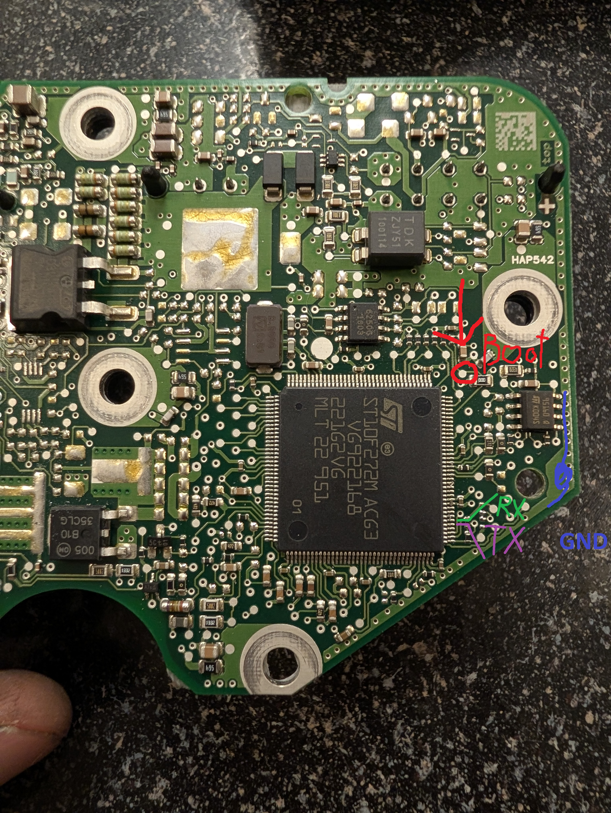

# UART BSL quick start

These scripts access the Haldex Gen 4 ST10 bootstrap loader (BSL) over UART
for recovery, flash readout, and a basic code-execution check.

UART is garbage and soldering these teeny wires is evil, but I gave up on getting CAN BSL working with my J2534, it just doesnt like it. Probably easy with a not J2534.
Dump is chunked because I couldnt get watchdog service working, so we just, read what we can before watchdog reset, and then let it reset. So boot must stay shorted for this. BSL flash isnt a thing, you just use the script to force it back into the user bootloader ready for a flash if its bootlooping. Boot needs to be held until you run the script, and then released, and then you go back to the main flashers and itl just, work over CAN.... unless you cooked the bootloader. Id be impressed if you did that, since it can't be flashed over CAN, but one never knows.

Rest of this is AI.

## Wiring and entering BSL

Use [BSLPins.png](BSLPins.png) to locate the labelled **RX, TX, and BOOT (P04)**
connections on the PCB.



- Connect USB-UART **TX to ECU RX**, and USB-UART **RX to ECU TX**.
- Connect the adapter ground to ECU ground. Use a UART adapter with logic
  levels appropriate for the ECU; the UART pins are not 12 V power inputs.
- With ECU power off, **tie BOOT P04 (P0L.4) to ground**. It must be low
  when the ECU powers on/resets to enter BSL.
- Start the chosen script, then switch on the ECU's 12 V bench supply while
  the script waits for the handshake. A transmitted `0x00` and received
  **`0xD5`** indicate BSL synchronization.

Keep P04 grounded throughout a chunked dump: the dumper relies on repeated
watchdog resets returning to BSL. For normal startup afterwards, power off,
remove the P04-to-ground connection, then power on again.

## Setup

Run these commands from this `BSLScripts` folder. Replace `COM2` with your
adapter's port. Use only one serial script or CAN flasher at a time.

```powershell
$python = 'C:\Users\raccoon\AppData\Local\Programs\Python\Python311-32\python.exe'
& $python -m pip install pyserial
& $python -m serial.tools.list_ports
```

## Choose an operation

**Check UART and RAM code execution** (no flash writes):

```powershell
& $python test_bsl_beacon.py COM2 19200
```

After the `0xD5` handshake, the script uploads a small RAM payload and looks
for `0x55` beacons. Power-cycle into BSL again before running another script.

**Read the flash over UART:**

```powershell
& $python st10_chunked_dumper.py COM2 112000 --out original_bsl_320k.bin
```

Use a new output filename to preserve previous captures. The current code
reads **32-byte chunks**, despite older messages saying 64 bytes. It saves a
320 KiB CPU-addressed image containing 256 KiB of flash with the address gap
padded with `0xFF`. `--start` and `--count` select chunk indices/counts, not
byte addresses; there are 8192 chunks. An existing 320 KiB output is reused
and updated. A completed dump is not an independent checksum verification.

**Enter the resident CAN bootloader for recovery:**

```powershell
& $python st10_bsl_flasher.py --port COM2 --baud 112000 --unlock-can
```

This uploads a RAM flag/payload intended to transfer control to the resident
CAN bootloader. After the script finishes, remove the P04 ground connection
and keep ECU power on for the CAN handoff. Follow the
[shared flasher guide](../README.md) using `../runner.py` from this folder.
The flag is in RAM; this is not a permanent firmware modification. The
script's success message reports payload transmission, not a verified CAN
connection or application boot.

`enter_can_bootloader.py --port COM2 --baud 112000` is an alternative helper
that writes the RAM flag and jumps to the bootloader; `--unlock-can` uses a
software reset. **Direct UART flashing is not implemented:** the current
`st10_bsl_flasher.py --flash` path also calls CAN unlock and does not flash
the supplied file. Use the shared CAN flasher for actual writes.

If there is no `0xD5` response, check the COM port, crossed RX/TX, common
ground, P04 grounding, and a fresh power cycle during the handshake window.
